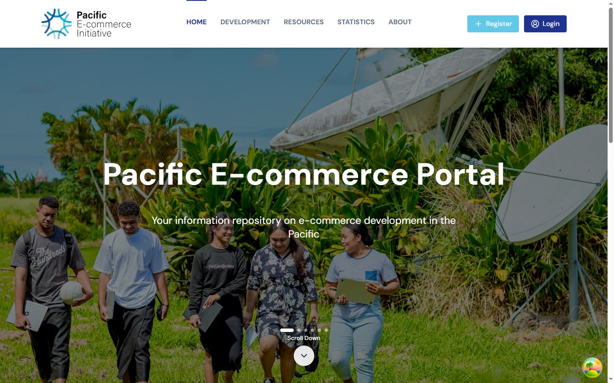
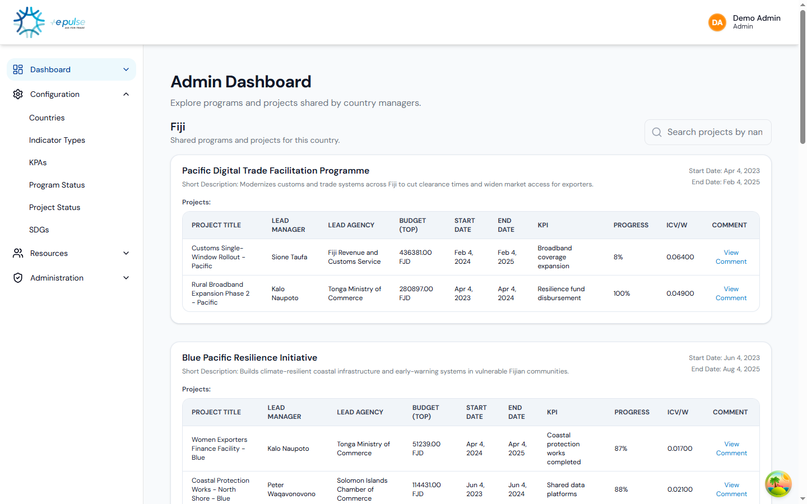
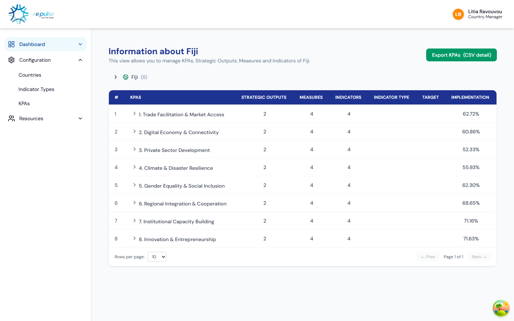
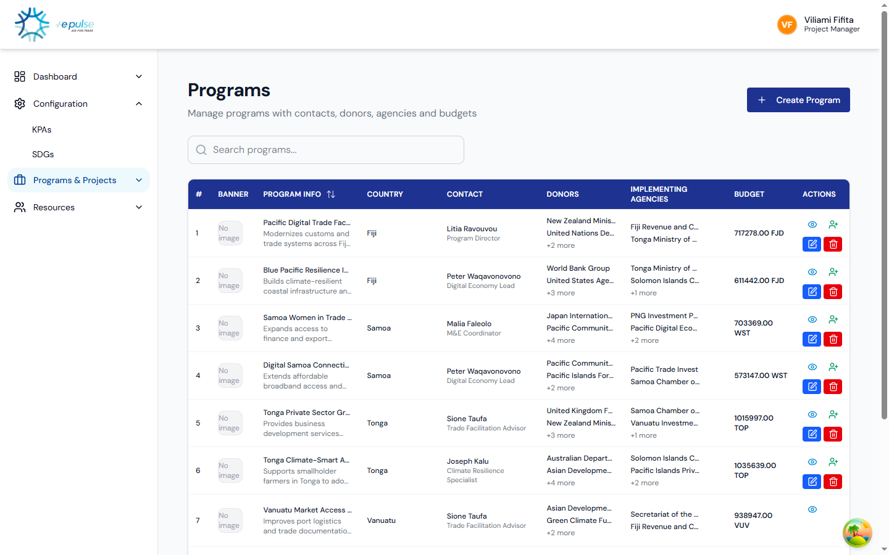
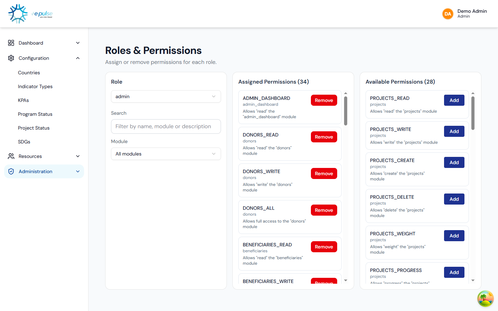
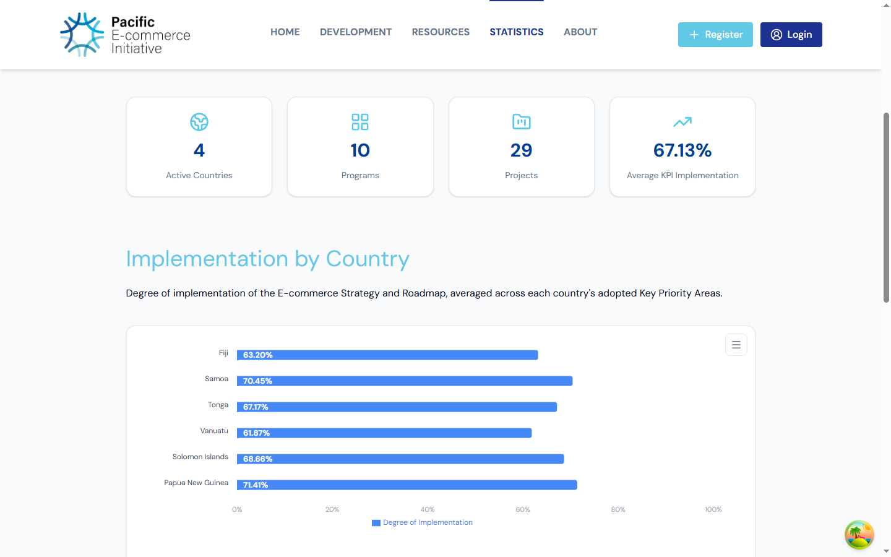

# Impact Dashboard

[](./LICENSE)
[](https://react.dev/)
[](https://www.typescriptlang.org/)
[](https://vitejs.dev/)
[](https://tailwindcss.com/)

A program & project management dashboard for tracking KPIs, SDGs, budgets and results across countries, donors and implementing agencies — with role-based access control, interactive analytics, and a full CRUD workflow for complex, multi-step forms.

**[Live Demo](#) — runs in a self-contained demo mode with realistic mock data, no backend required** <!-- TODO: replace with the deployed Vercel URL -->

The demo enforces a **real, restrictive role-based permission model** — three personas, each seeing a different slice of the app. Use the "Login as Demo ..." buttons on the login screen, or sign in manually with any email below and password `demo1234`:

| Role | Email | Can do |
|---|---|---|
| Admin | `demo@admin.com` | System administration: users, roles, countries, KPA/SDG/status catalogs — **cannot** create programs or projects |
| Country Manager | `demo@country.com` | Activates their country and builds its KPA → Strategic Output → Measure → Indicator framework |
| Project Manager | `demo@projects.com` | Creates and manages programs & projects once a country's KPA framework exists |

---

## Screenshots

| | |
|---|---|
| **Public site** — landing page, no login required | **Admin Dashboard** — cross-country rollup, admin role |
|  |  |
| **Country KPA tracking** — country manager role, with Excel export | **Programs & Projects** — full CRUD, project manager role |
|  |  |
| **Roles & Permissions** — admin's own permissions are restricted, not "god mode" | **Public Statistics** — regional rollups, no login required |
|  |  |

---

## About this project

This is the frontend of a full-stack platform used to manage development-cooperation programs: countries, programs, projects, Key Performance Areas (KPAs), indicators, SDGs, donors, beneficiaries and implementing agencies, rolled up into dashboards at the country, program and project level. It also ships a small public-facing site (embeddable via iframe) for sharing progress externally.

The backend is a separate **Laravel 12 REST API built with a DDD (Domain-Driven Design) architecture**. That repository is private, but every request/response contract this frontend relies on is visible in the code here (`src/shared/lib/axios.ts`, and each feature's `api`/`services` folder) — available on request for anyone who wants to see the full-stack integration.

To keep this portfolio deployment free and always available, the live demo runs against a **mocked API layer** (`src/mocks/`) instead of the real backend — see [Demo mode](#demo-mode) below. The real integration code (axios clients, interceptors, React Query hooks, auth flow) ships unchanged; only the network layer is swapped at build time.

## Features

- **Realistic role-based access control (RBAC)** — three distinct roles (admin, country manager, project manager) with genuinely different, non-overlapping permissions — not a single all-powerful admin. JWT-based auth with scope/permission gating down to individual UI actions (`Can` / `CanAny` components)
- **Interactive dashboards** — admin, country and project-level rollups built with Chart.js / Recharts
- **KPI & SDG tracking** — hierarchical KPAs → strategic outputs → measures → indicators, mapped against UN Sustainable Development Goals
- **Full CRUD workflows** — multi-step forms with `react-hook-form` + `zod` validation (programs, projects, donors, beneficiaries, agencies, users)
- **Data export** — client-side Excel (`.xlsx`) export of KPI/country data
- **File uploads** — drag-and-drop image uploads (SDG assets) via `react-dropzone`
- **Public-facing site** — a marketing/informational site (Home, Programs, Projects, Progress explorer, regional Statistics, Resources, About) designed to also be embedded via iframe into an external site, with `postMessage`-based origin validation
- **reCAPTCHA-protected registration** and a full auth flow (login, register, forgot/reset password, email verification)

## Tech stack

| Category | Stack |
|---|---|
| Framework | React 19, TypeScript, Vite 7 |
| Styling | Tailwind CSS v4, Radix UI, shadcn/ui, `class-variance-authority` |
| Data fetching | TanStack React Query, Axios |
| State | Zustand (auth store), React Query cache |
| Forms & validation | React Hook Form, Zod |
| Charts | Chart.js (`react-chartjs-2`), Recharts |
| Routing | React Router v7 |
| Tooling | ESLint, TypeScript ESLint, React Compiler (babel plugin) |

## Architecture

The codebase follows a **feature-based ("screaming") architecture** — folders are named after what the app does, not generic technical layers:

```
src/
├─ features/              # one folder per domain feature, each self-contained:
│  ├─ auth/                #   api/, components/, hooks/, pages/, store/, types/, utils/
│  ├─ dashboard/            #   admin-dashboard, country-dashboard, project-dashboard
│  ├─ programs/, projects/, country/, donors/, beneficiaries/, agency/
│  ├─ kpa/, indicator/, indicator-type/, sdgs/
│  ├─ roles-permissions/, users/, configuration/, resources/
│  └─ public/               #   public-facing, iframe-embeddable pages
├─ shared/                # cross-cutting concerns
│  ├─ lib/                  #   axios clients (apiClient, publicApiClient), React Query client
│  ├─ components/           #   layout, data tables, async search-select
│  └─ hooks/, types/
├─ components/ui/         # shadcn/ui primitives
├─ routes/                # AppRouter, PrivateRoute, PublicRoute
├─ mocks/                 # demo-mode mock API layer (see below)
└─ lib/, hooks/, utils/, types/, assets/
```

Each feature owns its own API layer, types and UI — there's no central `services/`/`store/` grab-bag; a change to "Projects" touches `src/features/projects/` and nothing else.

## Demo mode

Because the real backend is a private repo and this portfolio deployment has zero hosting budget, the live demo runs with `VITE_DEMO_MODE=true`. In that mode, `src/main.tsx` swaps in a mocked network layer (`src/mocks/`) that intercepts the app's existing Axios clients and returns realistic, internally-consistent fake data (dashboard numbers, KPI trees, project lists, etc. are all derived from one shared seed dataset, so figures line up across screens).

This means:
- Every screen renders fully, with real-looking data — nothing is empty or broken.
- The actual integration code (interceptors, auth flow, React Query hooks, error handling) is exercised exactly as it would be against the real API.
- Pointing `VITE_API_BASE_URL` at a real backend and leaving `VITE_DEMO_MODE` unset restores the exact same app running against live data — no fork, no separate branch.

## Getting started

### Requirements
- Node.js 18+
- npm 9+

### Setup
```bash
npm install
cp .env.example .env.local
```

Edit `.env.local`:
- To run against a real backend, set `VITE_API_BASE_URL` to its URL.
- To run locally in demo mode (no backend needed), set `VITE_DEMO_MODE=true`.

### Scripts
```bash
npm run dev       # start the dev server (http://localhost:5173)
npm run build     # type-check and build for production (dist/)
npm run preview   # preview the production build locally
npm run lint      # run ESLint
```

## Deployment

This is a static SPA (no server-side rendering, no dev-server proxy) — it deploys to any static host. The included `vercel.json` configures SPA routing (rewrite all routes to `index.html`) and a `Content-Security-Policy` for iframe embedding. It's deployed here on [Vercel](https://vercel.com)'s free Hobby tier with:

| Env var | Value on this deployment |
|---|---|
| `VITE_DEMO_MODE` | `true` |
| `VITE_API_BASE_URL` | unused placeholder (all requests are mocked) |
| `VITE_RECAPTCHA_SITE_KEY` | Google's public test site key |

## License

MIT — see [LICENSE](./LICENSE).
